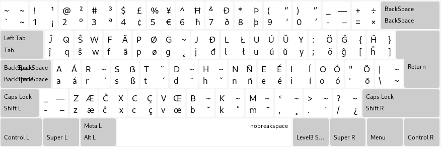

# Esperanto \(Colemak\) клавара аранѓо

Ен алиай лингвой: [English](README.md), [Esperanto](README.eo.md), [Есперанто](README.eo-cyrl.md), [𐑧𐑕𐑐𐑧𐑮𐑨𐑵𐑑𐑩](README.eo-shaw.md)

---

## Инстали ен Линуксо

Виду на [LINUX.eo-cyrl.md](./LINUX.eo-cyrl.md)
