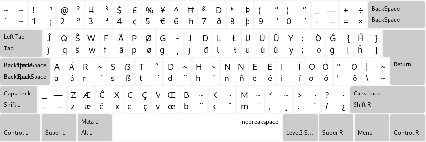

# Esperanto Colemak klavaro aranĝo

Traduko: [english](README.md), [中文](README.zh-CN.md), [español](README.es.md), [العربية](README.ar.md), [português](README.pt.md), [русский](README.ru.md), [bahasa](README.id.md), [türkçe](README.tr.md), [български](README.bg.md)

Jen mia provo fari klavaran aranĝon bazitan sur Colemak, adaptitan por la lingvo Esperanto.

## Ligiloj

* [Hejmpaĝo](https://salif.github.io/colemak-eo/)
* [Fontkodo](https://codeberg.org/salif/colemak-eo)
* [Diskutoj (Github)](https://github.com/salif/colemak-eo/discussions)
* [Babilejo (Element/Matrix)](https://matrix.to/#/#salif-colemak:mozilla.org)

## Instalado

### Instalado en Linukso

Vidu ĉi tiun paĝon: [LINUX.eo.md](./LINUX.eo.md)

### Instalado sur aliaj operaciumoj

Mi ne povas helpi vin, provu mem trovi manieron instali en via OS.

## Kontribuante

Se vi trovas cimon aŭ volas sugesti plibonigon, bonvolu dividi ĝin ĉe [Codeberg] aŭ [Github], aŭ sendi tiri peton.

[Github]: https://github.com/salif/colemak-eo/discussions
[Codeberg]: https://codeberg.org/salif/colemak-eo/issues

## Aliaj klavaraj aranĝoj

* [Por rusa lingvo](https://salif.github.io/colemak-ru/)
* [Por turka lingvo](https://salif.github.io/colemak-tr/)
* [Por bulgara lingvo](https://salif.github.io/colemak-bg/)

---

Ĉi tiu paĝo enhavas aŭtomate tradukitan tekston
