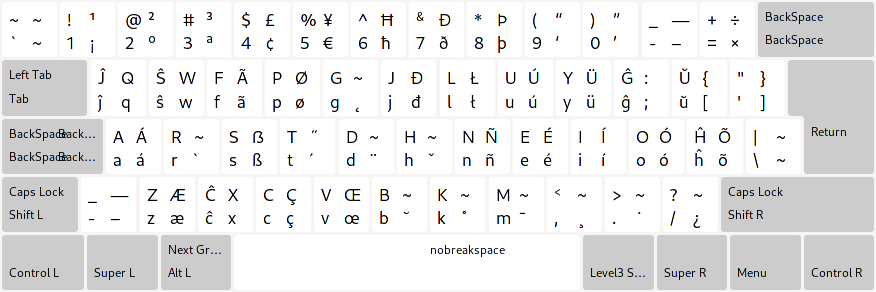

# Esperanto \(Colemak\) klavara aranĝo

En aliaj lingvoj: [English](README.md), [Esperanto](README.eo.md), [Есперанто](README.eo-cyrl.md), [𐑧𐑕𐑐𐑧𐑮𐑨𐑵𐑑𐑩](README.eo-shaw.md)

---

## Instali en Linukso

Vidu na [LINUX.eo.md](./LINUX.eo.md)
